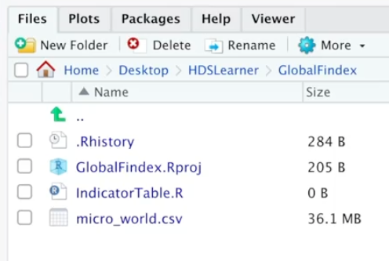
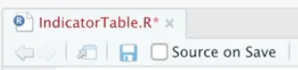
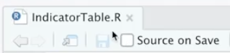

```{r klippy, echo = FALSE, include = TRUE}
klippy::klippy(position = c("top", "right"), tooltip_message = "Copy")
```

In this first lesson of Module 2, you were introduced to the tidyverse, a package
of packages that provides you with all of the tools for translating your data
into useful information and knowledge. 

In Module 1, you created an R project called `GlobalFindex.Rproj` and in that same
folder you created a script called `IndicatorTable.R`. Open the `GlobalFindex.Rproj`
now. Doing so will open an Rstudio session. 

To access the functions in the tidyverse, you will first need to install it
if you haven't already done so. You can do so with line of code below, but 
remember, you only need to install the tidyverse on your computer once. So 
if you previously installed it you won't need to do so again. 

```{r, eval = FALSE}
# I'm not actually running this code:
install.packages("tidyverse")
```

Observe that I wrote an R comment above. In R, any line that starts with a pound
or hashtag symbol (`#`) is ignored. It is meant as a way for the code writer
to communicate to the code reader.

Having installed the tidyverse, you now need to load it into your current R session,
which you can do with the following code:

```{r, eval = TRUE}
library(tidyverse)
```

You see a couple of messages here. First, remembering that the tidyverse is in
fact a package of packages, we are told which packages are loaded, and their version numbers. Second, we are told that two functions in the tidyverse, `filter` and `lag`, already
existed in our R sessions and are now 'masked' by their tidyverse variants.  

If you haven't yet done so, type this code (that is, `library(tidyverse)`) on the first line of your `IndicatorTable.R` script and then run it by simultaneously pressing Cmd+Enter (on your Mac) or Ctrl+Enter (on your Windows computer). Your 'enter' key may be labeled as 'return' -- on American keyboards its the button at the far right. 

## `read_csv()`

The function from the tidyverse that we'll practice using here is the `read_csv`
function, which takes a computer file is saved as a **c**omma-**s**eparated **v**alue (csv)
format on your computer and reads it into your R session. Look for the .csv suffix
on a computer file (ironically, if you double click that file to open it, most 
computers will use their spreadsheet software program, e.g. Excel, to view it, 
and you won't even see the commas that separate the values!).

We've saved the Global Findex data into a file called `micro_world.csv`, and it 
exists in the same folder as our project, which I can see from looking at the 
bottom-right panel of my RStudio session:





Go back to `IndicatorTable.R` and type the following line of code, which will
read in the Global Findex data and assign it as an object in your R session entitled
`micro_world`:

```{r}
micro_world <- read_csv("micro_world.csv")
```

Remember, typing the line of code in your script doesn't run the code; at this 
point it is a set of instructions to be run. Tell R to run the code by pressing
Cmd+Enter (Mac) or Ctrl+Enter (Windows). If successfully run, you should see 
output in your console similar to what you see here: some information
about the numbers of rows and columns in your data and the variable (column) names. 

The last thing to do is save your work. Right now, you should see that your 
file is in red font and has an asterisk after the R:




Press Cmd+S (Mac) or Ctrl+S (Windows) to save your work, and it should change to
black font with no asterisk:


